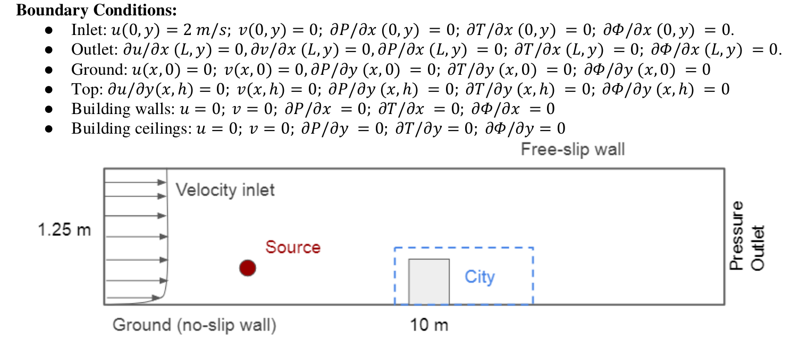
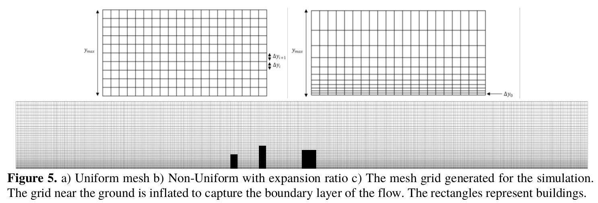
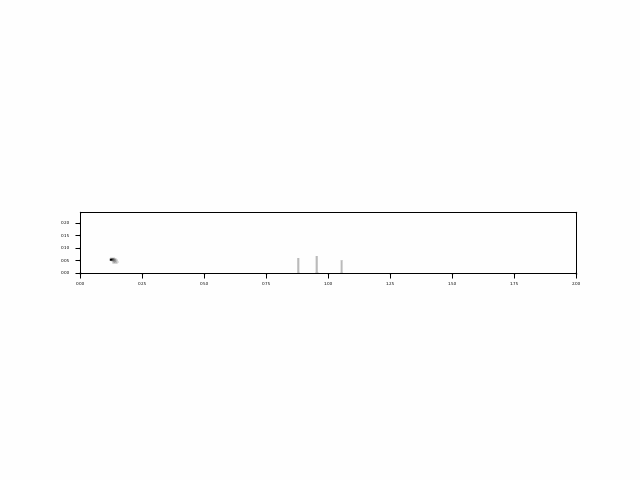

# 2D LES CFD Solver

Final project for the CFD course (24718) at CMU.

## Objectives
   
* In our project, we have set out to model the ill effects of having pollution sources in the vicinity of a city. Power plants are a source of constant heat and pollution. While they are designed for maximum thermal efficiency and economy in mind, the long-term health impacts due to pollution should also
be taken into account. 
    
* A 2D transient incompressible Navier-Stokes solver was developed in Python that models energy and scalar transport, incorporating buoyancy effects. 
    
* 2D CFD parametric studies were performed on vertical positions of pollutant source and building configurations. 
    
* Our study establishes the need for computational analysis as a tool for policy decisions and regulations for city layouts and power plant locations. 

* We have also augmented our solver to solve for turbulent flows in the form of large eddy simulation (LES) based on the Smagorinsky-Lilly model.


## Setup

 - ### Computational Domain and Boundary Conditions


 - ### Mesh for the Simulation



## Results

  - ### Flow of pollutant around City


  - ### Heat flow around City


## Steps to Run Solver

```
    python3 main.py
```

**NOTE -** The constants for the simulation can be adjusted in the main.py and initialize.py files